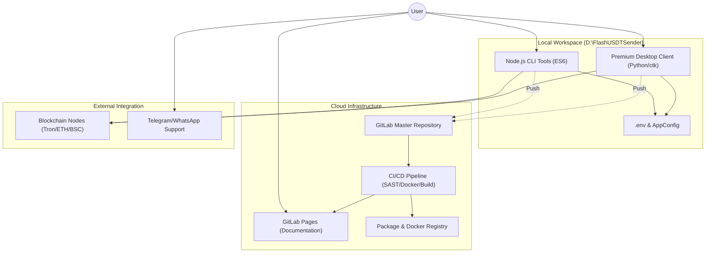
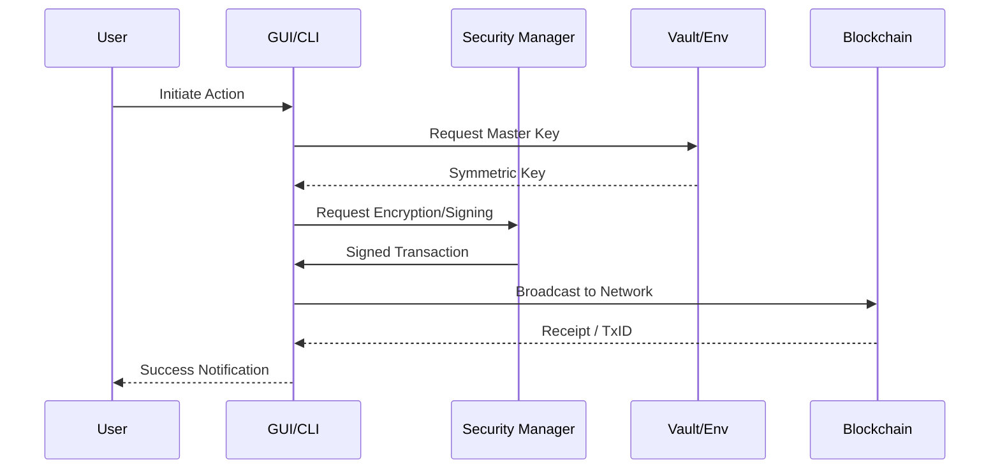

# System Architecture 🏛️

The Flash USDT Sender ecosystem is designed as a modular, multi-tier system that integrates high-performance GUI clients, specialized CLI tools, and scalable cloud-based backend services.

## 🏗️ High-Level Overview

## 🧩 Component Breakdown

### 1. Desktop Client (Python)
- **Core Engine**: Handles transaction simulation and provider orchestration.
- **Security Layer**: Fernet-based symmetric encryption for local data protection.
- **xFace GUI**: Advanced CustomTkinter implementation with High-DPI support.

### 2. CLI Ecosystem (Node.js)
- **Fast Interaction**: Optimized for scriptable, automated USDT transfers.
- **Architecture**: Modular commands (`send`, `balance`) with a central security hub.

### 3. DevOps Stack
- **GitLab-CI**: Multi-stage pipeline for Security, Build, and Deployment.
- **Docker**: Containerized backend and toolsets for environment parity.
- **Kubernetes**: Standardized orchestration for high-availability deployments.

---

## 🔐 Security Flow

---
© 2026 Osama Bin Likhon.
